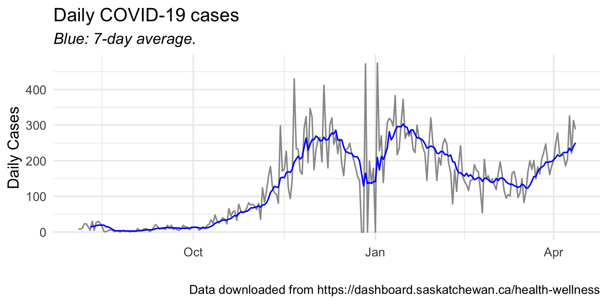

```{r setup, include=FALSE}
knitr::opts_chunk$set(echo = FALSE)
# Load packages
library(broom)
library(knitr)
```

## Results

This is a graph of the daily COVID cases in Saskatchewan, along with the 7-day average.



And these are the model fit results.

```{r}
fit <- readRDS("../cache/model-fit.rds")
kable(tidy(fit),
      caption = "Model fit results")
```

```{r}
kable(confint(fit), digits = 3, 
      col.names = c("Conf. Int. (LB)", "Conf. Int. (UB)"), 
      caption = "95% confidence interval")
```

